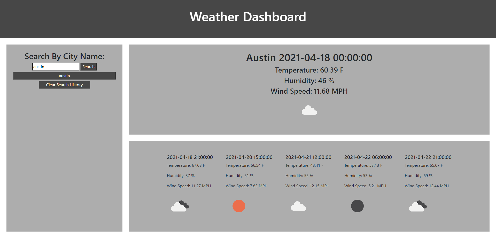

# Weather-Dashboard
## Features
* Allows user to search for desired city
* Displays weather conditions including: 
 * Wind 
 * Tempature
 * Humidity 
 * Cloud index.
* Search history is included, allowing user to click on past searched cities and seeing the weather conditions for that city.
* User has ability to clear the search history
## Screenshot of deployed webpage

## Links
[deployed](https://jacobduden.github.io/Weather-Dashboard/)

[github](https://github.com/jacobduden/Weather-Dashboard)